# Phần A

## Câu A1 — 3 cách nhúng CSS
### 1. Inline CSS
Ví dụ:
```html
<p style="color: red; font-size: 20px;">Đây là đoạn văn màu đỏ</p>
-Ưu điểm: Nhanh, dễ áp dụng cho một phần tử cụ thể.
-Nhược điểm: Khó bảo trì, không tái sử dụng, làm code rối.
-Khi dùng: Chỉ nên dùng khi cần chỉnh sửa nhanh một element duy nhất.
```

### 2. Internal CSS

<!DOCTYPE html>
<html>
<head>
  <style>
    p {
      color: blue;
      font-size: 18px;
    }
  </style>
</head>
<body>
  <p>Đây là đoạn văn màu xanh</p>
</body>
</html>
-Ưu điểm: Dễ quản lý trong cùng file HTML, không cần file ngoài.
-Nhược điểm: Không tái sử dụng cho nhiều trang, file HTML dài và khó đọc.
-Khi dùng: Thích hợp cho trang nhỏ, demo, hoặc khi chỉ có một file HTML.

### 3. External CSS

<!DOCTYPE html>
<html>
<head>
  <link rel="stylesheet" href="style.css">
</head>
<body>
  <p class="external">Đây là đoạn văn màu tím</p>
</body>
</html>
/* style.css */
p.external {
  color: purple;
  font-weight: bold;
}
-Ưu điểm: Tái sử dụng cho nhiều trang, dễ bảo trì, tách biệt code HTML và CSS.
-Nhược điểm: Cần thêm file ngoài, nếu mất link thì CSS không hiển thị.
-Khi dùng: Dùng cho dự án thực tế, website nhiều trang.
## Câu hỏi thêm
Nếu cùng một element có cả 3 cách CSS đồng thời áp dụng thì Inline CSS thắng vì mức độ ưu tiên cao nhất. Sau đó đến Internal, rồi External.

## Câu A2

1. h1 → "ShopTLU"
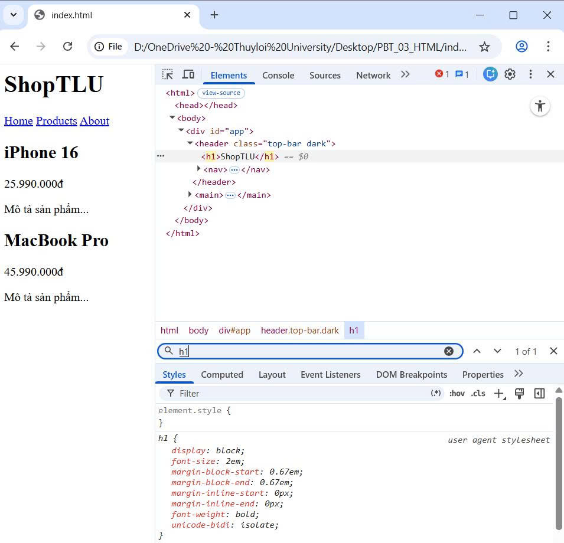

2. .price → "25.990.000đ", "45.990.000đ"
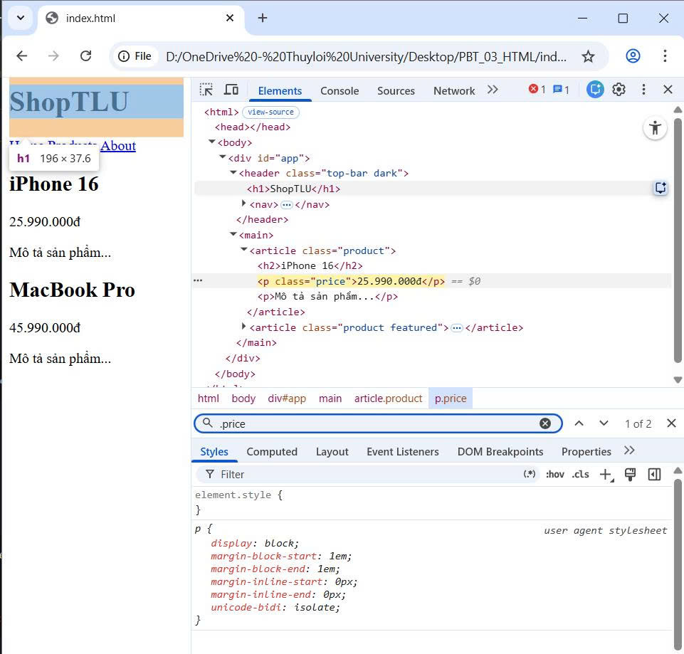

3. #app header → toàn bộ <header> chứa: "ShopTLU", "Home", "Products", "About"
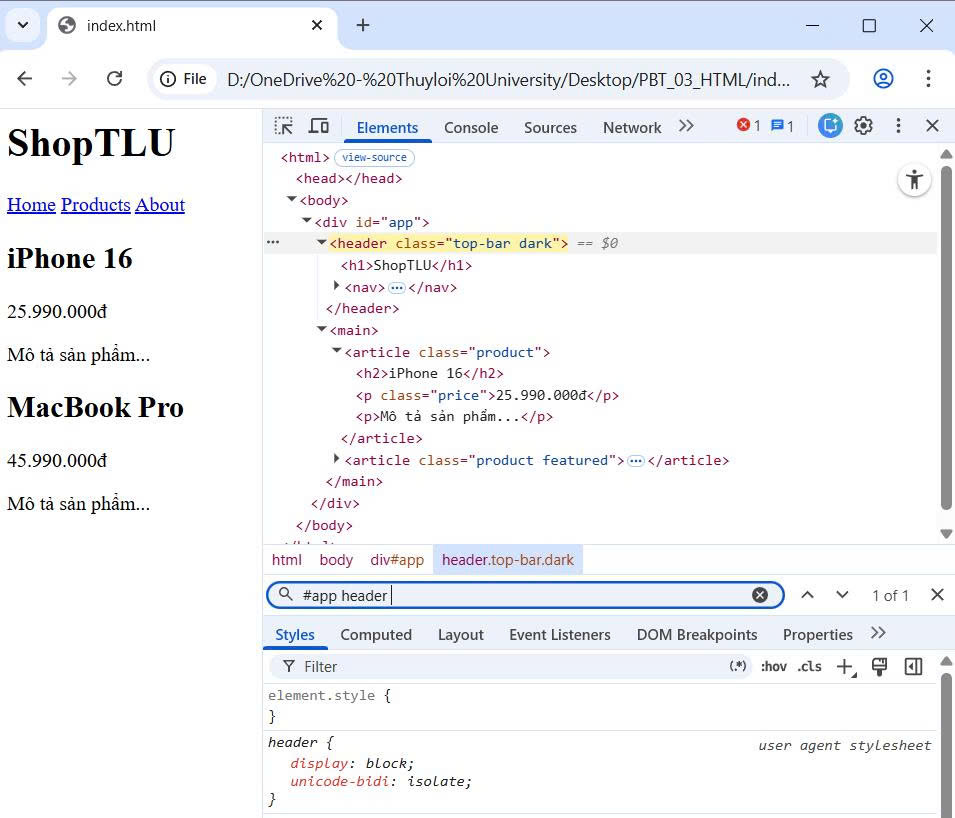

4. nav a:first-child → "Home"
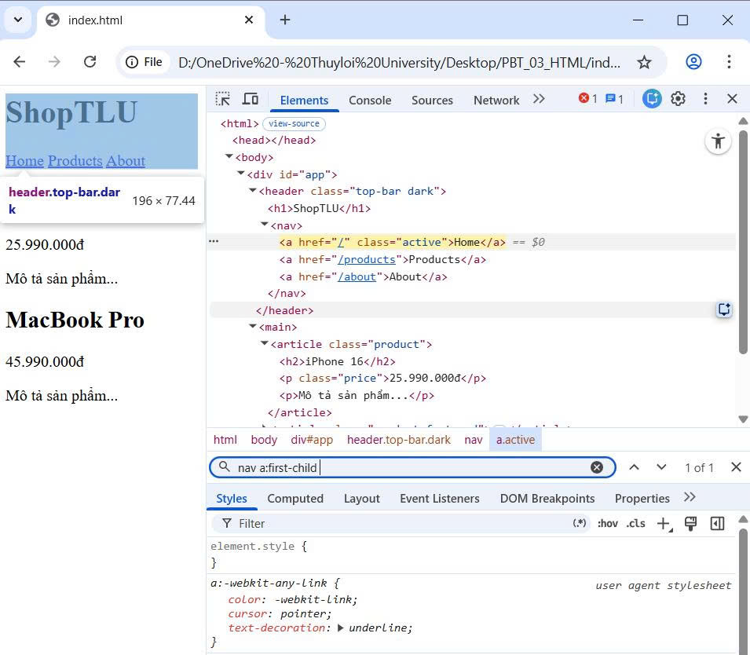

5. .product.featured h2 → "MacBook Pro"
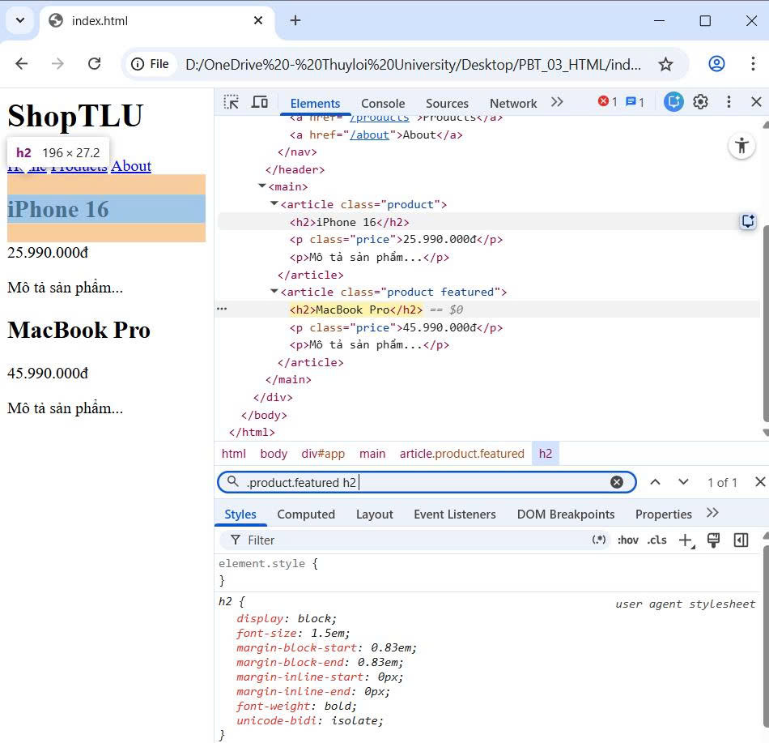

6. article > p → "25.990.000đ", "Mô tả sản phẩm...", "45.990.000đ", "Mô tả sản phẩm..."
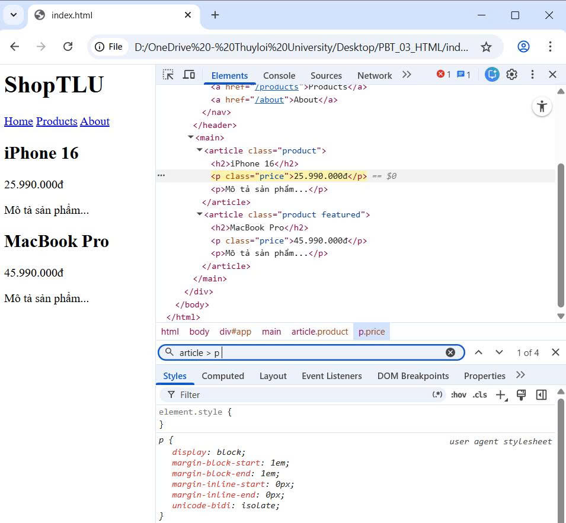

7. a[href="/"]→ "Home"
![Screenshot a[href="/"]](a_href.jpg)

8. .top-bar.dark h1 → "ShopTLU"
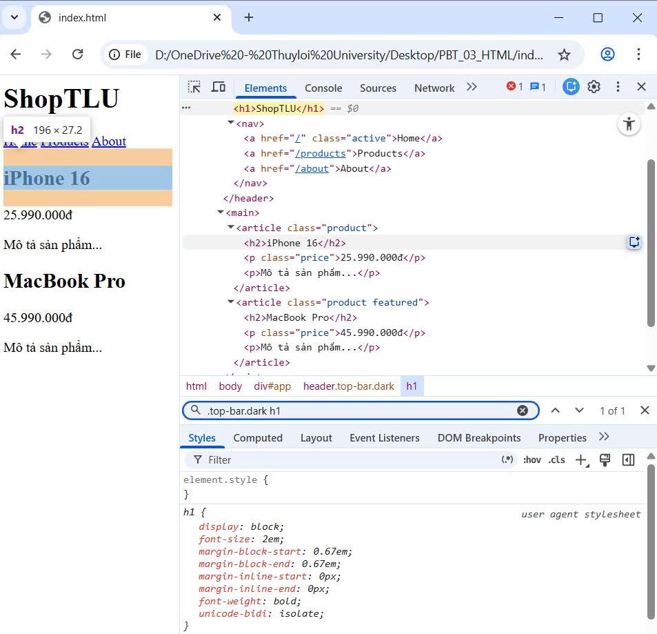

## Câu A3


<h2>Trường hợp 1: content-box (mặc định)</h2>

<pre>
.box-1 {
    width: 400px;
    padding: 20px;
    border: 5px solid black;
    margin: 10px;
}
</pre>

<p>
width mặc định chỉ tính phần content.
Padding và border sẽ cộng thêm vào kích thước thực tế.
</p>

<p>
Chiều rộng hiển thị:
</p>

<pre>
400 + (20 × 2) + (5 × 2)
= 400 + 40 + 10
= 450px
</pre>

<p>
→ Chiều rộng hiển thị = 450px
</p>

<p>
Không gian chiếm trên trang:
</p>

<pre>
450 + (10 × 2)
= 450 + 20
= 470px
</pre>

<p>
→ Không gian chiếm trên trang = 470px
</p>

<hr>

<h2>Trường hợp 2: border-box</h2>

<pre>
.box-2 {
    box-sizing: border-box;
    width: 400px;
    padding: 20px;
    border: 5px solid black;
    margin: 10px;
}
</pre>

<p>
Khi dùng border-box thì width đã bao gồm:
content + padding + border
</p>

<p>
→ Chiều rộng hiển thị = 400px
</p>

<p>
Kích thước content thực tế:
</p>

<pre>
400 - (20 × 2) - (5 × 2)
= 400 - 40 - 10
= 350px
</pre>

<p>
→ Kích thước content thực tế = 350px
</p>

<p>
Không gian chiếm trên trang:
</p>

<pre>
400 + (10 × 2)
= 400 + 20
= 420px
</pre>

<p>
→ Không gian chiếm trên trang = 420px
</p>

<hr>

<h2>Trường hợp 3: Margin Collapse</h2>

<pre>
.box-a { margin-bottom: 25px; }
.box-b { margin-top: 40px; }
</pre>

<p>
Khoảng cách giữa 2 box KHÔNG phải:
</p>

<pre>
25 + 40 = 65px
</pre>

<p>
Vì margin theo chiều dọc sẽ bị collapse (gộp margin).
Browser chỉ lấy margin lớn hơn.
</p>

<pre>
max(25px, 40px) = 40px
</pre>

<p>
→ Khoảng cách giữa box-a và box-b = 40px
</p>

<p>
Giải thích:
Margin-top và margin-bottom của các block element
không cộng lại mà bị gộp thành một margin duy nhất.
</p>

<hr>

<h2>Nâng cao</h2>

<pre>
.box-a { margin-bottom: -10px; }
.box-b { margin-top: 40px; }
</pre>

<p>
Khi có margin âm:
</p>

<pre>
40 + (-10) = 30px
</pre>

<p>
→ Khoảng cách = 30px
</p>

## Câu A4

<h1>1. Tính Specificity Score</h1>

<h3>Rule A</h3>

<pre>
p { color: black; }
</pre>

<p>
Có:
</p>

<pre>
0 ID
0 class
1 tag
</pre>

<p>
→ Specificity = (0, 0, 1)
</p>

<hr>

<h3>Rule B</h3>

<pre>
.price { color: blue; }
</pre>

<p>
Có:
</p>

<pre>
0 ID
1 class
0 tag
</pre>

<p>
→ Specificity = (0, 1, 0)
</p>

<hr>

<h3>Rule C</h3>

<pre>
#main-price { color: red; }
</pre>

<p>
Có:
</p>

<pre>
1 ID
0 class
0 tag
</pre>

<p>
→ Specificity = (1, 0, 0)
</p>

<hr>

<h3>Rule D</h3>

<pre>
p.price { color: green; }
</pre>

<p>
Có:
</p>

<pre>
0 ID
1 class
1 tag
</pre>

<p>
→ Specificity = (0, 1, 1)
</p>

<hr>

<h1>2. Element sẽ có màu gì?</h1>

<p>
Element sẽ có màu đỏ (red).
</p>

<p>
Vì Rule C có specificity cao nhất:
</p>

<pre>
(1, 0, 0)
</pre>

<p>
Selector chứa ID nên mạnh hơn class và tag.
</p>

<hr>

<h1>3. Nếu thêm inline style</h1>

<pre>
style="color: orange;"
</pre>

<p>
Element sẽ có màu cam (orange).
</p>

<p>
Vì inline style có độ ưu tiên cao hơn:
</p>

<pre>
inline style > ID > class > tag
</pre>

<hr>

<h1>4. Nếu Rule A thêm !important</h1>

<pre>
p { color: black !important; }
</pre>

<p>
Element sẽ có màu đen (black).
</p>

<p>
Vì:
</p>

<pre>
!important
</pre>

<p>
được ưu tiên cao hơn specificity thông thường.
</p>

<p>
Dù Rule C có ID mạnh hơn,
nhưng Rule A có !important nên sẽ thắng.
</p>

# Phần C

## Câu C2

<h1>1. "Sản phẩm A" (h2)</h1>

<p>
Font-size = 20px
</p>

<p>
Vì:
</p>

<pre>
.card .title {
    font-size: 20px;
}
</pre>

<p>
selector này tác động trực tiếp vào:
</p>

<pre>
h2 class="title highlight"
</pre>

<hr>

<p>
Color = green
</p>

<p>
Vì:
</p>

<pre>
.highlight {
    color: green !important;
}
</pre>

<p>
!important có độ ưu tiên cao hơn:
</p>

<pre>
#featured .title {
    color: red;
}
</pre>

<p>
nên màu xanh thắng màu đỏ.
</p>

<hr>

<h1>2. "Mô tả sản phẩm" (p trong featured)</h1>

<p>
Color = blue
</p>

<p>
Vì:
</p>

<pre>
.card {
    color: blue;
}
</pre>

<p>
thẻ p có:
</p>

<pre>
.card p {
    color: inherit;
}
</pre>

<p>
inherit nghĩa là kế thừa màu từ phần tử cha.
</p>

<p>
Phần tử cha là:
</p>

<pre>
.card
</pre>

<p>
nên p kế thừa:
</p>

<pre>
color: blue;
</pre>

<hr>

<h1>3. "Sản phẩm B" (h2)</h1>

<p>
Font-size = 20px
</p>

<p>
Vì:
</p>

<pre>
.card .title {
    font-size: 20px;
}
</pre>

<hr>

<p>
Color = blue
</p>

<p>
Vì:
</p>

<pre>
.card {
    color: blue;
}
</pre>

<p>
h2 không có color riêng,
nên kế thừa màu từ:
</p>

<pre>
.card
</pre>

<p>
→ màu xanh dương.
</p>

<hr>

<h1>4. "Mô tả sản phẩm B"</h1>

<p>
Color = green
</p>

<p>
Vì:
</p>

<pre>
.highlight {
    color: green !important;
}
</pre>

<p>
!important có độ ưu tiên rất cao.
</p>

<p>
Nên p sẽ có màu xanh lá.
</p>

<hr>

<h1>5. Giải thích Cascade và Inheritance</h1>

<h2>Inheritance</h2>

<p>
Inheritance là cơ chế kế thừa CSS từ phần tử cha.
</p>

<p>
Ví dụ:
</p>

<pre>
.card {
    color: blue;
}
</pre>

<p>
Các phần tử bên trong card sẽ kế thừa màu xanh
nếu không có color riêng.
</p>

<hr>

<h2>Cascade</h2>

<p>
Cascade là cơ chế quyết định CSS nào được áp dụng.
</p>

<p>
Thứ tự ưu tiên:
</p>

<pre>
!important
Inline style
ID
Class
Tag
</pre>

<p>
Ví dụ:
</p>

<pre>
.highlight {
    color: green !important;
}
</pre>

<p>
sẽ thắng:
</p>

<pre>
#featured .title {
    color: red;
}
</pre>

<p>
vì có !important.
</p>

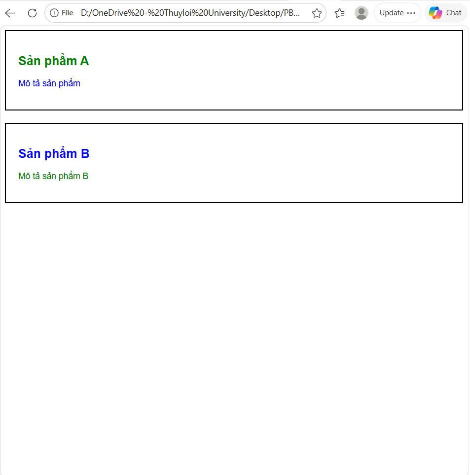

# Phần B

## Câu B2

### PHẦN 1 — Content Box vs Border Box

#### Kết quả đo bằng DevTools

##### Hộp 1 — content-box

- Chiều rộng thực tế = 350px

Tính toán:

- width = 300px
- padding = 20 × 2 = 40px
- border = 5 × 2 = 10px

Tổng:

```text
300 + 40 + 10 = 350px
```

---

##### Hộp 2 — border-box

- Chiều rộng thực tế = 300px

Vì:

```css
box-sizing: border-box;
```

nên:

```text
width đã bao gồm:
content + padding + border
```

---

### Giải thích sự khác biệt

#### content-box

width chỉ tính phần content.

Padding và border sẽ cộng thêm vào kích thước thực tế.

---

#### border-box

width đã bao gồm:

- content
- padding
- border

nên kích thước thực tế không tăng thêm.

---

### PHẦN 2 — Layout 3 cột

#### Trường hợp KHÔNG dùng border-box

##### Sidebar

```text
250 + (15 × 2) + (2 × 2)
= 284px
```

##### Content

```text
500 + (20 × 2) + (2 × 2)
= 544px
```

##### Ads

```text
250 + (15 × 2) + (2 × 2)
= 284px
```

---

#### Tổng kích thước

```text
284 + 544 + 284
= 1112px
```

Container chỉ có:

```text
1000px
```

nên layout bị vỡ.

---

#### Trường hợp dùng border-box

Khi dùng:

```css
box-sizing: border-box;
```

thì width đã bao gồm:

- content
- padding
- border

Nên tổng đúng bằng:

```text
250 + 500 + 250 = 1000px
```

layout không bị vỡ.

---

### Screenshot DevTools

#### Content Box

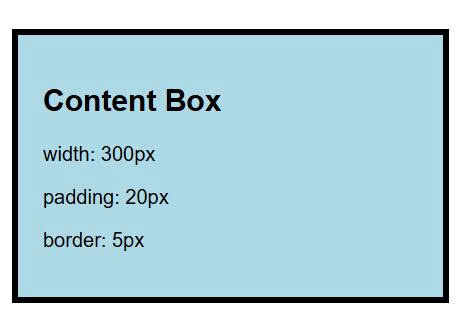

---

#### Border Box

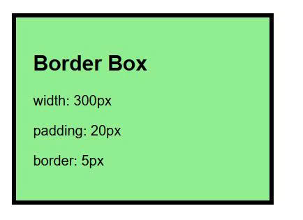

---

#### Layout lỗi

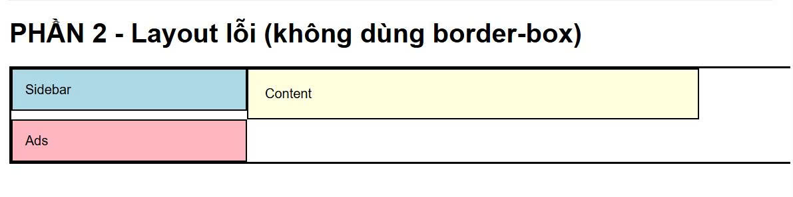

---

#### Layout đúng

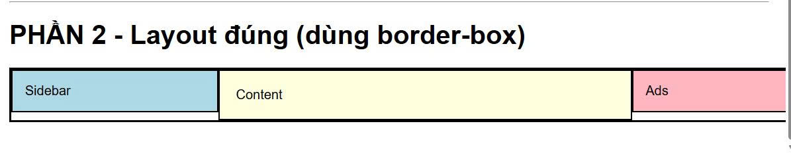

## Câu B3

# CSS Specificity Lab

## 1. Danh sách 10 rules + specificity

| Rule | Selector | Specificity |
|---|---|---|
| 1 | p | (0,0,1) |
| 2 | .text | (0,1,0) |
| 3 | .highlight | (0,1,0) |
| 4 | p.text | (0,1,1) |
| 5 | p.highlight | (0,1,1) |
| 6 | .text.highlight | (0,2,0) |
| 7 | #demo | (1,0,0) |
| 8 | p#demo | (1,0,1) |
| 9 | #demo.text | (1,1,0) |
| 10 | p#demo.text.highlight | (1,2,1) |

---

## 2. Element cuối cùng hiển thị màu gì?

Element hiển thị màu:

```text
gold
```

Vì selector:

```css
p#demo.text.highlight
```

có specificity cao nhất:

```text
(1,2,1)
```

nên rule này thắng tất cả các rule khác.

---

## 3. Giải thích Specificity

CSS ưu tiên theo thứ tự:

```text
Inline Style
ID
Class
Tag
```

Selector càng nhiều ID và class thì specificity càng cao.

---

## 4. Nếu thay đổi thứ tự rules trong file CSS

### Trường hợp specificity khác nhau

Kết quả KHÔNG đổi.

Vì specificity cao hơn luôn thắng.

Ví dụ:

```css
#demo
```

vẫn thắng:

```css
.text
```

dù viết trước hay sau.

---

### Trường hợp specificity bằng nhau

Rule viết SAU sẽ thắng.

Ví dụ:

```css
.text
.highlight
```

đều có specificity:

```text
(0,1,0)
```

nên selector nào viết sau sẽ được áp dụng.

---

# Screenshot kết quả

